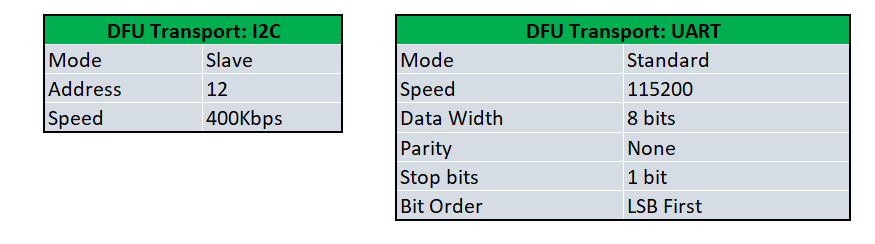

# PSoC 6 MCU: Basic Device Firmware Upgrade (DFU)

This example demonstrates basic device firmware update (DFU), also known as "bootloading", with PSoC® 6 MCU. This includes downloading an application from a host and installing it in device flash, and then transferring control to that application. This example bundles two applications:

**Bootloader app:** Implements a [DFUSDK](https://github.com/cypresssemiconductorco/dfu)-based basic bootloader application run by the CM4+ CPU. The bootloader handles image download, verification, and upgrades. When the image is valid, the bootloader lets the CM4 CPU boot the application.

**Blinky app:** This is a tiny application run by the CM4 CPU that blinks an LED at a 5-Hz rate continuously. This application transfers control to the bootloader when the user button is pressed.

**Note:** This example supports only *I2C* and *UART* for DFU transport currently.

[Provide feedback on this Code Example.](https://cypress.co1.qualtrics.com/jfe/form/SV_1NTns53sK2yiljn?Q_EED=eyJVbmlxdWUgRG9jIElkIjoiQ0UyMzI1MDQiLCJTcGVjIE51bWJlciI6IjAwMi0zMjUwNCIsIkRvYyBUaXRsZSI6IlBTb0MgNiBNQ1U6IEJhc2ljIERldmljZSBGaXJtd2FyZSBVcGdyYWRlIChERlUpIiwicmlkIjoicnhodiIsIkRvYyB2ZXJzaW9uIjoiMS4wLjAiLCJEb2MgTGFuZ3VhZ2UiOiJFbmdsaXNoIiwiRG9jIERpdmlzaW9uIjoiTUNEIiwiRG9jIEJVIjoiSUNXIiwiRG9jIEZhbWlseSI6IlBTT0MifQ==)

## Requirements

- [ModusToolbox® software](https://www.cypress.com/products/modustoolbox-software-environment) v2.2.1

    **Note:** This code example version requires ModusToolbox software version 2.2.1 or later and is not backward compatible with v2.2 or older versions.

- Board Support Package (BSP) minimum required version: 2.0.0

- Programming Language: C

- Associated Parts: All [PSoC® 6 MCU](http://www.cypress.com/PSoC6) parts

## Supported Toolchains (make variable 'TOOLCHAIN')

- GNU Arm® Embedded Compiler v9.3.1 (`GCC_ARM`) - Default value of `TOOLCHAIN`
- Arm compiler v6.13 (`ARM`)
- IAR C/C++ compiler v8.42.2 (`IAR`)

## Supported Kits (make variable 'TARGET')

- [PSoC 6 BLE Pioneer Kit](https://www.cypress.com/CY8CKIT-062-BLE) (`CY8CKIT-062-BLE`) - Default value of `TARGET`
- [PSoC 6 Wi-Fi BT Prototyping Kit](https://www.cypress.com/CY8CPROTO-062-4343W) (`CY8CPROTO-062-4343W`)
- [PSoC 6 WiFi-BT Pioneer Kit](https://www.cypress.com/CY8CKIT-062-WiFi-BT) (`CY8CKIT-062-WIFI-BT`)
- [PSoC 6 BLE Prototyping Kit](https://www.cypress.com/CY8CPROTO-063-BLE) (`CY8CPROTO-063-BLE`)
- [PSoC 62S2 Wi-Fi BT Pioneer Kit](https://www.cypress.com/CY8CKIT-062S2-43012) (`CY8CKIT-062S2-43012`)
- [PSoC 62S1 Wi-Fi BT Pioneer Kit](https://www.cypress.com/CYW9P62S1-43438EVB-01) (`CYW9P62S1-43438EVB-01`)
- [PSoC 62S1 Wi-Fi BT Pioneer Kit](https://www.cypress.com/CYW9P62S1-43012EVB-01) (`CYW9P62S1-43012EVB-01`)
- [PSoC 62S3 Wi-Fi BT Prototyping Kit](https://www.cypress.com/CY8CPROTO-062S3-4343W) (`CY8CPROTO-062S3-4343W`)

## Supported Transports (make variable 'TRANSPORT_OPT')

Default transport is I2C. Refer [Operation](## Operation) section for instructions to change the `TRANSPORT_OPT`.

| TARGET | UART | I2C |
| :---- | :---- | :---- |
| CY8CKIT-062-BLE | Yes | Yes |
| CY8CPROTO-062-4343W | Yes | Yes |
| CY8CKIT-062-WIFI-BT | Yes | Yes |
| CY8CPROTO-063-BLE | Yes | Yes |
| CY8CKIT-062S2-43012 | Yes | Yes |
| CYW9P62S1-43438EVB-01 | Yes | Yes |
| CYW9P62S1-43012EVB-01 | Yes | Yes |
| CY8CPROTO-062S3-4343W | Yes | Yes |

## Hardware Setup

This example uses the board's default configuration. See the kit user guide to ensure that the board is configured correctly.

**Note:** The PSoC 6 BLE Pioneer Kit (CY8CKIT-062-BLE) and the PSoC 6 WiFi-BT Pioneer Kit (CY8CKIT-062-WIFI-BT) ship with KitProg2 installed. The ModusToolbox software requires KitProg3. Before using this code example, make sure that the board is upgraded to KitProg3. The tool and instructions are available in the [Firmware Loader](https://github.com/cypresssemiconductorco/Firmware-loader) GitHub repository. If you do not upgrade, you will see an error like "unable to find CMSIS-DAP device" or "KitProg firmware is out of date".

## Software Setup

Install a terminal emulator if you don't have one. Instructions in this document use [Tera Term](https://ttssh2.osdn.jp/index.html.en).

This example requires no additional software or tools.

## Using the Code Example

Create the project and open it using one of the following:

<details><summary><b>In Eclipse IDE for ModusToolbox</b></summary>

1. Click the **New Application** link in the **Quick Panel** (or, use **File** > **New** > **ModusToolbox Application**). This launches the [Project Creator](http://www.cypress.com/ModusToolboxProjectCreator) tool.

2. Pick a kit supported by the code example from the list shown in the **Project Creator - Choose Board Support Package (BSP)** dialog.

   When you select a supported kit, the example is reconfigured automatically to work with the kit. To work with a different supported kit later, use the [Library Manager](https://www.cypress.com/ModusToolboxLibraryManager) to choose the BSP for the supported kit. You can use the Library Manager to select or update the BSP and firmware libraries used in this application. To access the Library Manager, click the link from the **Quick Panel**.

   You can also just start the application creation process again and select a different kit.

   If you want to use the application for a kit not listed here, you may need to update the source files. If the kit does not have the required resources, the application may not work.

3. In the **Project Creator - Select Application** dialog, choose the example by enabling the checkbox.

4. Optionally, change the suggested **New Application Name**.

5. Enter the local path in the **Application(s) Root Path** field to indicate where the application needs to be created.

   Applications that can share libraries can be placed in the same root path.

6. Click **Create** to complete the application creation process.

For more details, see the [Eclipse IDE for ModusToolbox User Guide](https://www.cypress.com/MTBEclipseIDEUserGuide) (locally available at *{ModusToolbox install directory}/ide_{version}/docs/mt_ide_user_guide.pdf*).

</details>

<details><summary><b>In Command-line Interface (CLI)</b></summary>

ModusToolbox provides the Project Creator as both a GUI tool and a command line tool to easily create one or more ModusToolbox applications. See the "Project Creator Tools" section of the [ModusToolbox User Guide](https://www.cypress.com/ModusToolboxUserGuide) for more details.

Alternatively, you can manually create the application using the following steps:

1. Download and unzip this repository onto your local machine, or clone the repository.

2. Open a CLI terminal and navigate to the application folder.

   On Linux and macOS, you can use any terminal application. On Windows, open the **modus-shell** app from the Start menu.

   **Note:** The cloned application contains a default BSP file (*TARGET_xxx.mtb*) in the *deps* folder. Use the [Library Manager](https://www.cypress.com/ModusToolboxLibraryManager) (`make modlibs` command) to select and download a different BSP file, if required. If the selected kit does not have the required resources or is not [supported](#supported-kits-make-variable-target), the application may not work.

3. Import the required libraries by executing the `make getlibs` command.

Various CLI tools include a `-h` option that prints help information to the terminal screen about that tool. For more details, see the [ModusToolbox User Guide](https://www.cypress.com/ModusToolboxUserGuide) (locally available at *{ModusToolbox install directory}/docs_{version}/mtb_user_guide.pdf*).

</details>

<details><summary><b>In Third-party IDEs</b></summary>

1. Follow the instructions from the **In Command-line Interface (CLI)** section to create the application, and import the libraries using the `make getlibs` command.

2. Export the application to a supported IDE using the `make <ide>` command.

   For a list of supported IDEs and more details, see the "Exporting to IDEs" section of the [ModusToolbox User Guide](https://www.cypress.com/ModusToolboxUserGuide) (locally available at *{ModusToolbox install directory}/docs_{version}/mtb_user_guide.pdf*).

3. Follow the instructions displayed in the terminal to create or import the application as an IDE project.

</details>

## Operation

1. Connect the board to your PC using the provided USB cable through the KitProg3 USB connector.

2. Build and program the bootloader to the board using one of the following:

   <details><summary><b>Using Eclipse IDE for ModusToolbox</b></summary>

      1. Select the bootloader project in the Project Explorer.

      2. In the **Quick Panel**, scroll down, and click **\<Application Name> Program (KitProg3_MiniProg4)**.
      </details>

      **Note:** *I2C* is configured as the default DFU transport. To change the DFU transport, edit the Makefile to set `TRANSPORT_OPT?=<transport>`.

   <details><summary><b>Using CLI</b></summary>

     From the terminal, execute the `make program` command to build and program the application using the default toolchain to the default target with default DFU transport. You can specify a target, toolchain and transport manually:
      ```
      make program TARGET=<BSP> TOOLCHAIN=<toolchain> TRANSPORT_OPT=<transport>
      ```

      Example:
      ```
      make program TARGET=CY8CKIT-062-BLE TOOLCHAIN=GCC_ARM TRANSPORT_OPT=UART
      ```
</details>

3. After programming, press the *RESET Button* on the board. The bootloader starts automatically and starts blinking the LED. Confirm that the kit LED blinks at approximately 1 Hz.

4. Generate an upgradable application image using one of the following. On a successful build, an *\<APPNAME>.cyacd2* file will be generated.

   <details><summary><b>Using Eclipse IDE for ModusToolbox</b></summary>

      1. Select the blinky project in the Project Explorer.

      2. In the **Quick Panel**, scroll down, and click **\<Application Name> Build (KitProg3_MiniProg4)**.
      </details>

   <details><summary><b>Using CLI</b></summary>

     From the terminal, execute the `make build` command to build the application using the default toolchain to the default target. You can specify a target and toolchain manually:
      ```
      make build TARGET=<BSP> TOOLCHAIN=<toolchain>
      ```

      Example:
      ```
      make build TARGET=CY8CKIT-062-BLE TOOLCHAIN=GCC_ARM
      ```
   **Note:** The application is DFU-transport-agnostic.

</details>

5. Perform device firmware upgrade using the DFU Host Tool:

   1. Open the [DFU Host Tool](https://www.cypress.com/file/504426/download). Connect to the device using the transport configured.

   2. Select *blinky_crc.cyacd2* from the file browse option window. By default, it will be generated under `mtb-example-psoc6-dfu-basic/<blinky_cm4>/build/` path on successful build.

   3. Select an appropriate port based on the transport (`TRANSPORT_OPT`) configured in the bootloader. *I2C* is the default transport configuration. Select *400kHz* speed, set address to *12*, and then click **Program**.

   4. Observe the image download progress status on the progress bar, and wait for the download to complete.

      **Note:** See [DFU Host Tool](https://www.cypress.com/file/504426/download) for further details on selecting a port and configuring it for communication based on the transport enabled in bootloader.

**Figure 1. Downloading the Application Using the DFU Host Tool**


After a successful download, the device will boot to *blinky_cm4*. Observe the user LED blinking at 5 Hz.

### Switching Between *bootloader* and *application*

Dynamic switching between the bootloader and the application is enabled with user button events. Press the user button to switch to the bootloader while the application is running. Similarly, press the user button to switch to the application while the bootloader is running. Note that a switching request will be honored by the bootloader only if there is a valid application in the memory.

**NOTE:** Build the App0 and App1 projects with the same toolchain. Application transfer may fail otherwise. Check the Build Settings for each project.

### Instructions for using Keil
1. To export to Keil, MDK Compiler must be installed. Please refer [ModusToolBox](https://www.cypress.com/products/modustoolbox-software-environment) User guide chapter **Export to Keil µVision 5** for instructions.
   
   **Note:** Before running `make uvision5` command make sure that CY_COMPILER_PATH in Makefile is set to Compilers bin directory. Please refer [KBA229177](https://community.cypress.com/t5/Knowledge-Base-Articles/Managing-the-Makefile-for-ModusToolbox-v2-x-KBA229177/ta-p/250624) to manage the Makefile.

2. Generate the *.cyacd2* file in Keil uVision as follows:

   1. Under *Output* tab, append *.elf* extension to change the name of the executable to generate \<Application Name>.elf on build. 

   2. Under *User* tab add post build instructions to generate *.cyacd2* file. You can write Post build commands as follows:

	   *Post build command 1* :
	   \<Install path of ModusToolbox>/tools_2.2/cymcuelftool-1.0/bin/cymcuelftool.exe --sign {Local Path to \<Application Name>.elf} CRC --output {Local Path to generate \<Application Name>_crc.elf} ;
	
	   *Post build command 2* :
	   \<Install path of ModusToolbox>/tools_2.2/cymcuelftool-1.0/bin/cymcuelftool.exe -P {Local Path to \<Application Name>_crc.elf} --output {Local Path to generate \<Application Name>_crc.cyacd2} ;
	
	   Example :
	
	   *Post build command 1* (Run#1):
	   ```
	   C:/Users/<USERNAME>/ModusToolbox/tools_2.2/cymcuelftool-1.0/bin/cymcuelftool.exe --sign C:/ModusWorkspace/mtb-example-psoc6-dfu-basic/blinky_cm4/blinky_cm4_build/blinky_cm4.elf CRC --output C:/ModusWorkspace/mtb-example-psoc6-dfu-basic/blinky_cm4/blinky_cm4_build/blinky_cm4_crc.elf ;
	   ```
	   *Post build command 2* (Run#2):
	   ```
	   C:/Users/<USERNAME>/ModusToolbox/tools_2.2/cymcuelftool-1.0/bin/cymcuelftool.exe -P C:/ModusWorkspace/mtb-example-psoc6-dfu-basic/blinky_cm4/blinky_cm4_build/blinky_cm4_crc.elf --output C:/ModusWorkspace/mtb-example-psoc6-dfu-basic/blinky_cm4/blinky_cm4_build/blinky_cm4_crc.cyacd2 ;
	   ```

**Figure 2. Keil Post build steps**


### Instructions for using IAR
1. To export to IAR, IAR Compiler must be installed. Please refer [ModusToolBox](https://www.cypress.com/products/modustoolbox-software-environment) User guide chapter **Export IAR EWARM** for instructions.
   
   **Note:** Before running `make ewarm8` command make sure that CY_COMPILER_PATH in Makefile is set to Compilers bin directory. Please refer [KBA229177](https://community.cypress.com/t5/Knowledge-Base-Articles/Managing-the-Makefile-for-ModusToolbox-v2-x-KBA229177/ta-p/250624) to manage the Makefile. 

2. Generate the *.cyacd2* file in IAR EW for Arm as follows:

   1. Use **Project** > **Options** > Linker > Output tab to change the Output file extension from *.out* to *.elf*. 
   
   2. Create a *.bat* file in the Project directory using any Text Editor(for Ex.Notepad) for post build operation to generate a *.cyacd2* file. You can write post build command in *.bat* file as follows:

      *Post build command* (Syntax):
      \<Install path of ModusToolbox>/tools_2.2/cymcuelftool-1.0/bin/cymcuelftool.exe --sign {Local Path to \<Application Name>.elf} CRC --output {Local Path to generate \<Application Name>_crc.elf} && \<Install path of ModusToolbox>/tools_2.2/cymcuelftool-1.0/bin/cymcuelftool.exe -P {Local Path to \<Application Name>_crc.elf} --output {Local Path to generate \<Application Name>_crc.cyacd2} 

      Example:

      *Post build command* (RUN):
      ```
      C:/Users/<USERNAME>/ModusToolbox/tools_2.2/cymcuelftool-1.0/bin/cymcuelftool.exe --sign C:/ModusWorkspace/mtb-example-psoc6-dfu-basic/blinky_cm4/Debug/Exe/blinky_cm4.elf CRC --output C:/ModusWorkspace/mtb-example-psoc6-dfu-basic/blinky_cm4/Debug/Exe/blinky_cm4_crc.elf && C:/Users/<USERNAME>/ModusToolbox/tools_2.2/cymcuelftool-1.0/bin/cymcuelftool.exe -P C:/ModusWorkspace/mtb-example-psoc6-dfu-basic/blinky_cm4/Debug/Exe/blinky_cm4_crc.elf --output C:/ModusWorkspace/mtb-example-psoc6-dfu-basic/blinky_cm4/Debug/Exe/blinky_cm4_crc.cyacd2
      ```
   
   3. Under **Project** > **Options** > Build Actions tab, Select a path to created *.bat* file for post build operation. and Click **OK**. 

**Figure 3. IAR Post build steps**


## Debugging

You can debug the example to step through the code. In the IDE, use the **\<Application Name> Debug (KitProg3_MiniProg4)** configuration in the **Quick Panel**. For more details, see the "Program and Debug" section in the [Eclipse IDE for ModusToolbox User Guide](https://www.cypress.com/MTBEclipseIDEUserGuide).

**Note:** **(Only while debugging)** On the CM4 CPU, some code in `main()` may execute before the debugger halts at the beginning of `main()`. This means that some code executes twice - once before the debugger stops execution, and again after the debugger resets the program counter to the beginning of `main()`. See [KBA231071](https://community.cypress.com/docs/DOC-21143) to learn about this and for the workaround.

## Design and Implementation

### Overview

This example demonstrates basic Device Firmware Upgrade (DFU) operations based on the [DFUSDK](https://github.com/cypresssemiconductorco/dfu).

### Bootloader Implementation

This bootloader sample implements an immutable bootloader with support for upgrading the application.

The [DFU Host Tool](https://www.cypress.com/file/504426/download) (typically running on the host PC) sends the application (*\<APPNAME>.cyacd2*) to the device. The bootloader receives the application image in chunks and overwrites the existing application image. See Figure 4 below. If a DFU session is interrupted, the application firmware will not be in a usable state. However, the device can still run the bootloader and perform necessary actions to download and install the application in subsequent DFU sessions.

**Figure 4. DFU Design Overview**


### DFU Interfaces

The bootloader supports *I2C* and *UART* interfaces for communicating with the DFU host. The *COMPONENT_CUSTOM_DESIGN_MODUS* directory includes all the necessary configurations to select the supported interfaces. See Figure 5 for default configuration details. These default configurations can be changed according to the use case. However, you must ensure that the configuration of the DFU Host tool matches with that of the bootloader.

**Figure 5. DFU Transport Configurations**



### Memory Layout

The first 8-KB region of the flash is reserved for the CM0+ CPU. 64 KB is reserved for the bootloader followed by a 128-KB reserved region for future enhancements. Another 64 KB is allocated to the application firmware followed by the reserved region. The size of this Empty/Reserved region depends on the size of the flash available on the selected target device. See respective device datasheets for details. The last 1-KB region of the flash is reserved for bootloader metadata.

To change the memory layout or usage, update the respective target linker script files. The linker scripts can also be modified to define dedicated regions of the memory for each application.

The RAM is shared by the bootloader and the blinky applications, with a common area used by both projects. The RAM regions must be aligned to the 1-KB boundary because they contain the Interrupt Vector Table Remapped at the start.

**Figure 6. DFU Memory Map**


### Software Reset

When transferring control from one application to another, the recommended method is through a device software reset. This enables each application to initialize device hardware blocks and signal routing from a known state. It is possible to freeze the state of I/O pins so that they are maintained through a software reset. Defined portions of SRAM are also maintained through a software reset. For more information, see the device-specific Technical Reference Manual.

### Running the Code Example on a Single-CPU MCU

This code example is designed to run both application and bootloader on the CM4 CPU. The CM0+ CPU is reserved, which runs a tiny pre-built binary that transfers control to the CM4 CPU on every power cycle. For single-CPU devices, you must modify the linker script to exclude the CM0+ binary.

### Resources and Settings

**Table 1. Bootloader Resources**

| Resource  |  Alias/Object     |    Purpose     |
| :------- | :------------    | :------------ |
| SCB (I2C) (PDL) | DFU_I2C          | I2C slave driver to communicate with the DFU host |
| SCB (UART)(PDL) | DFU_UART          | UART driver to communicate with the DFU host |
| GPIO (HAL)    | CYBSP_USER_LED         | User LED                  |
| GPIO (HAL)    | CYBSP_USER_BTN         | User button                  |

**Table 2. Application Resources**

| Resource  |  Alias/Object     |    Purpose     |
| :------- | :------------    | :------------ |
| GPIO (HAL)    | CYBSP_USER_LED         | User LED                  |
| GPIO (HAL)    | CYBSP_USER_BTN         | User button                  |

## Related Resources

| Application Notes                                            |                                                              |
| :----------------------------------------------------------- | :----------------------------------------------------------- |
| [AN228571](https://www.cypress.com/AN228571) – Getting Started with PSoC 6 MCU on ModusToolbox | Describes PSoC 6 MCU devices and how to build your first application with ModusToolbox |
| [AN221774](https://www.cypress.com/AN221774) – Getting Started with PSoC 6 MCU on PSoC Creator | Describes PSoC 6 MCU devices and how to build your first application with PSoC Creator |
| [AN210781](https://www.cypress.com/AN210781) – Getting Started with PSoC 6 MCU with Bluetooth Low Energy (BLE) Connectivity on PSoC Creator | Describes PSoC 6 MCU with BLE Connectivity devices and how to build your first application with PSoC Creator |
| [AN215656](https://www.cypress.com/AN215656) – PSoC 6 MCU: Dual-CPU System Design | Describes the dual-CPU architecture in PSoC 6 MCU, and shows how to build a simple dual-CPU design |
| **Code Examples**                                            |                                                              |
| [Using ModusToolbox](https://github.com/cypresssemiconductorco/Code-Examples-for-ModusToolbox-Software) | [Using PSoC Creator](https://www.cypress.com/documentation/code-examples/psoc-6-mcu-code-examples) |
| **Device Documentation**                                     |                                                              |
| [PSoC 6 MCU Datasheets](https://www.cypress.com/search/all?f[0]=meta_type%3Atechnical_documents&f[1]=resource_meta_type%3A575&f[2]=field_related_products%3A114026) | [PSoC 6 Technical Reference Manuals](https://www.cypress.com/search/all/PSoC%206%20Technical%20Reference%20Manual?f[0]=meta_type%3Atechnical_documents&f[1]=resource_meta_type%3A583) |
| **Development Kits**                                         | Buy at www.cypress.com                                       |
| [CY8CKIT-062-BLE](https://www.cypress.com/CY8CKIT-062-BLE) PSoC 6 BLE Pioneer Kit | [CY8CKIT-062-WiFi-BT](https://www.cypress.com/CY8CKIT-062-WiFi-BT) PSoC 6 WiFi-BT Pioneer Kit |
| [CY8CPROTO-063-BLE](https://www.cypress.com/CY8CPROTO-063-BLE) PSoC 6 BLE Prototyping Kit | [CY8CPROTO-062-4343W](https://www.cypress.com/CY8CPROTO-062-4343W) PSoC 6 Wi-Fi BT Prototyping Kit |
| [CY8CKIT-062S2-43012](https://www.cypress.com/CY8CKIT-062S2-43012) PSoC 62S2 Wi-Fi BT Pioneer Kit | [CY8CPROTO-062S3-4343W](https://www.cypress.com/CY8CPROTO-062S3-4343W) PSoC 62S3 Wi-Fi BT Prototyping Kit |
| [CYW9P62S1-43438EVB-01](https://www.cypress.com/CYW9P62S1-43438EVB-01) PSoC 62S1 Wi-Fi BT Pioneer Kit | [CYW9P62S1-43012EVB-01](https://www.cypress.com/CYW9P62S1-43012EVB-01) PSoC 62S1 Wi-Fi BT Pioneer Kit |
| [CY8CKIT-064B0S2-4343W](http://www.cypress.com/CY8CKIT-064B0S2-4343W) PSoC 64 Secure Boot Wi-Fi BT Pioneer Kit |            |
| **Libraries**                                                |                                                              |
| PSoC 6 Peripheral Driver Library (PDL) and docs  | [mtb-pdl-cat1](https://github.com/cypresssemiconductorco/mtb-pdl-cat1) on GitHub |
| Cypress Hardware Abstraction Layer (HAL) Library and docs    | [mtb-hal-cat1](https://github.com/cypresssemiconductorco/mtb-hal-cat1) on GitHub |
| **Middleware**                                               |                                                              |
| Links to all PSoC 6 MCU Middleware                           | [psoc6-middleware](https://github.com/cypresssemiconductorco/psoc6-middleware) on GitHub |
| **Tools**                                                    |                                                              |
| [Eclipse IDE for ModusToolbox](https://www.cypress.com/modustoolbox) | The cross-platform, Eclipse-based IDE for IoT designers that supports application configuration and development targeting converged MCU and wireless systems. |

## Other Resources

Cypress provides a wealth of data at www.cypress.com to help you select the right device, and quickly and effectively integrate it into your design.

For PSoC 6 MCU devices, see [How to Design with PSoC 6 MCU - KBA223067](https://community.cypress.com/docs/DOC-14644) in the Cypress community.

## Document History

Document Title: *CE232504* - *PSoC 6 MCU: Basic Device Firmware Upgrade (DFU)*

| Version | Description of Change |
| ------- | --------------------- |
| 1.0.0   | New code example      |

------

All other trademarks or registered trademarks referenced herein are the property of their respective owners.


-------------------------------------------------------------------------------

© Cypress Semiconductor Corporation (An Infineon Technologies Company), 2021. This document is the property of Cypress Semiconductor Corporation and its subsidiaries ("Cypress"). This document, including any software or firmware included or referenced in this document ("Software"), is owned by Cypress under the intellectual property laws and treaties of the United States and other countries worldwide. Cypress reserves all rights under such laws and treaties and does not, except as specifically stated in this paragraph, grant any license under its patents, copyrights, trademarks, or other intellectual property rights. If the Software is not accompanied by a license agreement and you do not otherwise have a written agreement with Cypress governing the use of the Software, then Cypress hereby grants you a personal, non-exclusive, nontransferable license (without the right to sublicense) (1) under its copyright rights in the Software (a) for Software provided in source code form, to modify and reproduce the Software solely for use with Cypress hardware products, only internally within your organization, and (b) to distribute the Software in binary code form externally to end users (either directly or indirectly through resellers and distributors), solely for use on Cypress hardware product units, and (2) under those claims of Cypress's patents that are infringed by the Software (as provided by Cypress, unmodified) to make, use, distribute, and import the Software solely for use with Cypress hardware products. Any other use, reproduction, modification, translation, or compilation of the Software is prohibited.<br />
TO THE EXTENT PERMITTED BY APPLICABLE LAW, CYPRESS MAKES NO WARRANTY OF ANY KIND, EXPRESS OR IMPLIED, WITH REGARD TO THIS DOCUMENT OR ANY SOFTWARE OR ACCOMPANYING HARDWARE, INCLUDING, BUT NOT LIMITED TO, THE IMPLIED WARRANTIES OF MERCHANTABILITY AND FITNESS FOR A PARTICULAR PURPOSE. No computing device can be absolutely secure. Therefore, despite security measures implemented in Cypress hardware or software products, Cypress shall have no liability arising out of any security breach, such as unauthorized access to or use of a Cypress product. CYPRESS DOES NOT REPRESENT, WARRANT, OR GUARANTEE THAT CYPRESS PRODUCTS, OR SYSTEMS CREATED USING CYPRESS PRODUCTS, WILL BE FREE FROM CORRUPTION, ATTACK, VIRUSES, INTERFERENCE, HACKING, DATA LOSS OR THEFT, OR OTHER SECURITY INTRUSION (collectively, "Security Breach"). Cypress disclaims any liability relating to any Security Breach, and you shall and hereby do release Cypress from any claim, damage, or other liability arising from any Security Breach. In addition, the products described in these materials may contain design defects or errors known as errata which may cause the product to deviate from published specifications. To the extent permitted by applicable law, Cypress reserves the right to make changes to this document without further notice. Cypress does not assume any liability arising out of the application or use of any product or circuit described in this document. Any information provided in this document, including any sample design information or programming code, is provided only for reference purposes. It is the responsibility of the user of this document to properly design, program, and test the functionality and safety of any application made of this information and any resulting product. "High-Risk Device" means any device or system whose failure could cause personal injury, death, or property damage. Examples of High-Risk Devices are weapons, nuclear installations, surgical implants, and other medical devices. "Critical Component" means any component of a High-Risk Device whose failure to perform can be reasonably expected to cause, directly or indirectly, the failure of the High-Risk Device, or to affect its safety or effectiveness. Cypress is not liable, in whole or in part, and you shall and hereby do release Cypress from any claim, damage, or other liability arising from any use of a Cypress product as a Critical Component in a High-Risk Device. You shall indemnify and hold Cypress, its directors, officers, employees, agents, affiliates, distributors, and assigns harmless from and against all claims, costs, damages, and expenses, arising out of any claim, including claims for product liability, personal injury or death, or property damage arising from any use of a Cypress product as a Critical Component in a High-Risk Device. Cypress products are not intended or authorized for use as a Critical Component in any High-Risk Device except to the limited extent that (i) Cypress's published data sheet for the product explicitly states Cypress has qualified the product for use in a specific High-Risk Device, or (ii) Cypress has given you advance written authorization to use the product as a Critical Component in the specific High-Risk Device and you have signed a separate indemnification agreement.<br />
Cypress, the Cypress logo, Spansion, the Spansion logo, and combinations thereof, WICED, PSoC, CapSense, EZ-USB, F-RAM, and Traveo are trademarks or registered trademarks of Cypress in the United States and other countries. For a more complete list of Cypress trademarks, visit cypress.com. Other names and brands may be claimed as property of their respective owners.
